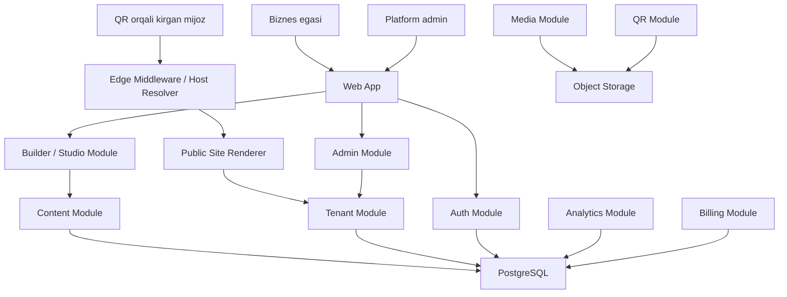

# QR Business Card Platform Architecture

## Maqsad

Bu loyiha kichik bizneslar uchun QR orqali ochiladigan bir sahifali web vizitkalar platformasi bo'ladi. Bitta asosiy domen ishlaydi, har bir biznes esa alohida subdomain yoki keyinroq custom domain orqali ochiladi.

Misollar:

- `bm.com` - platformaning landing, login va admin qismi
- `ali.bm.com` - bitta biznes sahifasi
- `barber.bm.com` - boshqa biznes sahifasi
- `business.uz` - keyingi bosqichda custom domain

Asosiy prinsip: kod bazasi bitta repo bo'lishi mumkin, lekin ichki arxitektura domain-modullarga ajratiladi. MVP modular monolith sifatida boshlanadi, keyin zarur joylari alohida service yoki workerga ajratiladi.

## Yuqori Darajadagi Arxitektura



## Runtime Qismlar

### 1. Web App

Next.js App Router ishlatiladi. Web App quyidagi UI zonalarni beradi:

- Marketing/landing pages: `bm.com`
- Auth pages: login, register, password reset
- Dashboard: biznes egasi profillarini boshqaradi
- Admin panel: siz yoki operatorlar biznes sahifalarini yaratadi
- Public renderer: QR orqali ochiladigan vizitka sahifasi

### 2. Edge Middleware / Host Resolver

Har bir request kelganda `Host` header tekshiriladi.

Qoidalar:

- `bm.com` yoki `www.bm.com` - asosiy app
- `*.bm.com` - subdomain bo'yicha tenant topiladi
- custom domain - `domains` jadvalidan tenant topiladi
- localhost development - `tenant.localhost:3000` yoki `/site/[slug]` fallback

Resolver natijasi:

```ts
type ResolvedHost =
  | { kind: "platform"; host: string }
  | { kind: "tenant"; tenantId: string; source: "subdomain" | "custom-domain" }
  | { kind: "not-found"; host: string };
```

### 3. Public Site Renderer

Public renderer biznes sahifasini template va komponentlar ro'yxati asosida chizadi.

Boshlang'ich komponentlar:

- `hero` - logo, nom, kategoriya, qisqa tavsif
- `contact_buttons` - telefon, Telegram, Instagram, WhatsApp
- `services` - xizmatlar yoki narxlar
- `gallery` - 3-12 ta rasm
- `location` - manzil va xarita linki
- `working_hours` - ish vaqti
- `links` - qo'shimcha linklar

Komponentlar database'da JSON sifatida saqlanadi, lekin rendererda har komponent uchun qat'iy TypeScript schema bo'ladi.

### 4. Builder / Studio

Builder birinchi versiyada drag-and-drop bo'lmaydi. Avval form-based builder qilinadi:

- template tanlash
- rang/theme tanlash
- komponentni yoqish/o'chirish
- komponent tartibini o'zgartirish
- rasm yuklash
- preview ko'rish
- publish qilish

Keyingi bosqichda drag-and-drop qo'shilishi mumkin, lekin MVP uchun bu shart emas.

### 5. Admin Module

Admin module sizga qo'lda xizmat ko'rsatish imkonini beradi:

- biznes yaratish
- subdomain band qilish
- owner biriktirish
- sahifa ma'lumotlarini to'ldirish
- QR yaratish
- sahifani publish/unpublish qilish
- mijoz uchun PDF/PNG QR yuklab berish

### 6. Auth Module

MVP'da ikki rol yetadi:

- `owner` - o'z biznes sahifalarini boshqaradi
- `admin` - hamma bizneslarni boshqaradi

Keyinroq `operator`, `designer`, `support` kabi rollar qo'shilishi mumkin.

### 7. Tenant Module

Tenant - platformadagi bitta biznes yoki tashkilot.

Tenant javob beradi:

- biznes nomi
- slug/subdomain
- owner
- status
- subscription holati
- public site bilan bog'lanish
- domain sozlamalari

### 8. QR Module

QR module har public sahifa uchun QR yaratadi.

MVP:

- QR PNG generatsiya
- QR linki: `https://slug.bm.com`
- admin paneldan yuklab olish

Keyingi bosqich:

- dynamic QR redirect: `bm.com/q/[code]`
- scan analytics
- QR design: logo, rang, frame
- PDF print layout

### 9. Analytics Module

Boshlang'ich analytics:

- sahifa ko'rildi
- CTA bosildi
- QR orqali kirildi
- top referrer
- sana bo'yicha scan/view soni

MVP'da analytics minimal bo'lishi mumkin. Lekin event modeli oldindan ajratib qo'yiladi.

### 10. Billing Module

MVP'da billingni qo'lda yuritish mumkin:

- `free`
- `trial`
- `active`
- `past_due`
- `blocked`

Keyinroq Click, Payme, Stripe yoki boshqa provider qo'shiladi. Billing module boshqa modullarga faqat subscription status beradi.

## Tavsiya Qilingan Texnologiyalar

### MVP

- Next.js App Router
- TypeScript
- Tailwind CSS
- PostgreSQL
- Prisma yoki Drizzle ORM
- Supabase Storage yoki S3-compatible storage
- NextAuth/Auth.js yoki Supabase Auth
- `qrcode` npm package
- Vercel deploy
- Wildcard DNS: `*.bm.com`

### Keyingi Bosqich

- Redis: cache, rate limit, short-lived preview state
- Queue worker: QR batch generation, image processing, email
- Object storage CDN
- OpenTelemetry yoki Sentry
- Payment provider integration

## Domain Module Chegaralari

Repo bitta bo'lsa ham, kod quyidagicha ajratiladi:

```text
src/
  app/
    (platform)/
    (dashboard)/
    (admin)/
    (public)/
    api/
  modules/
    auth/
    tenants/
    sites/
    builder/
    media/
    qr/
    analytics/
    billing/
  shared/
    db/
    config/
    validation/
    ui/
    utils/
```

Qoidalar:

- `modules/*` ichidagi biznes logika to'g'ridan-to'g'ri UI'ga aralashmaydi.
- `app/*` route, page va server actionlarni saqlaydi.
- `shared/db` database client va migration config uchun.
- Public renderer `sites` modulidagi published data contract bilan ishlaydi.
- Builder draft ma'lumot bilan ishlaydi, public sahifa faqat published snapshotni o'qiydi.

## Data Model

Boshlang'ich jadvallar:

```text
users
  id
  name
  email
  role
  created_at
  updated_at

tenants
  id
  owner_id
  name
  slug
  status
  plan
  created_at
  updated_at

domains
  id
  tenant_id
  hostname
  type
  status
  verified_at
  created_at

sites
  id
  tenant_id
  title
  description
  template_key
  theme
  status
  draft_version_id
  published_version_id
  created_at
  updated_at

site_versions
  id
  site_id
  version
  blocks
  seo
  created_by
  created_at
  published_at

media_assets
  id
  tenant_id
  type
  storage_key
  public_url
  alt
  width
  height
  created_at

qr_codes
  id
  tenant_id
  site_id
  code
  target_url
  image_asset_id
  status
  created_at

analytics_events
  id
  tenant_id
  site_id
  event_type
  metadata
  visitor_hash
  created_at

subscriptions
  id
  tenant_id
  plan
  status
  current_period_end
  provider
  provider_customer_id
  created_at
```

## Site Content Contract

`site_versions.blocks` shunday formatda saqlanadi:

```json
[
  {
    "id": "hero_1",
    "type": "hero",
    "enabled": true,
    "data": {
      "businessName": "Ali Barber",
      "headline": "Erkaklar sartaroshxonasi",
      "description": "Tez, toza va oldindan yozilish bilan xizmat.",
      "logoAssetId": "asset_123"
    }
  },
  {
    "id": "contact_1",
    "type": "contact_buttons",
    "enabled": true,
    "data": {
      "phone": "+998901234567",
      "telegram": "https://t.me/example",
      "instagram": "https://instagram.com/example"
    }
  }
]
```

Renderer unknown blocklarni ignore qiladi. Bu eski sahifalarni buzmasdan yangi block qo'shishga yordam beradi.

## Request Flow

### Public Subdomain

1. Visitor QR scan qiladi.
2. Browser `https://ali.bm.com` ga kiradi.
3. Middleware hostni `ali.bm.com` deb oladi.
4. Tenant resolver `ali` slug orqali tenant topadi.
5. Public route published site versionni oladi.
6. Renderer blocklarni template bo'yicha chizadi.
7. Analytics event yoziladi.

### Dashboard Edit

1. Owner login qiladi.
2. Dashboard tenant va site draftni ochadi.
3. Form orqali block data o'zgaradi.
4. Draft version saqlanadi.
5. Preview draftdan chiziladi.
6. Publish bosilganda yangi immutable `site_versions` yaratiladi.
7. Public sahifa published snapshotga o'tadi.

## Monolit Bo'lmagan Yondashuv

Boshlanishda bitta deploy bo'ladi, lekin ichki chegaralar alohida service kabi yuritiladi.

Ajratishga tayyor modullar:

- QR generation worker
- Analytics ingestion service
- Billing webhook service
- Media processing worker
- Public renderer edge service

Hozircha ularni bitta repo ichida modul qilib boshlash tavsiya qilinadi. Bu tezlik beradi, lekin kelajakdagi scalingni to'smaydi.

## Security

- Tenant data har doim `tenant_id` bilan scope qilinadi.
- Owner faqat o'z tenantlarini ko'radi.
- Admin route alohida role guard bilan himoyalanadi.
- Public renderer faqat published data o'qiydi.
- Upload fayllar type va size bo'yicha tekshiriladi.
- Analytics event PII saqlamaydi, visitor hash ishlatiladi.
- Custom domain verification TXT record yoki HTTP token bilan qilinadi.

## Deployment

MVP deployment:

- Vercel project
- Production domain: `bm.com`
- Wildcard domain: `*.bm.com`
- PostgreSQL: Supabase/Neon
- Storage: Supabase Storage/S3
- Environment variables Vercel'da saqlanadi

DNS:

```text
bm.com      A/CNAME -> platform
www.bm.com  CNAME   -> platform
*.bm.com    CNAME   -> platform
```

## MVP Scope

MVP uchun kerak:

- Admin login
- Tenant yaratish
- Subdomain band qilish
- Site draft/publish
- 5-6 ta block
- Public renderer
- QR PNG generation
- Basic SEO metadata
- Basic analytics: view va button click

MVP uchun shart emas:

- Drag-and-drop builder
- Payment automation
- Custom domain
- Multi-language builder
- Advanced analytics
- Template marketplace

## Nomlash

Ishchi nomlar:

- Brand: `BM`, `Bizmark`, `Cardly`, `QRCard`
- Core entity: `tenant`
- Public page: `site`
- Page content unit: `block`
- Business dashboard: `studio`

Final brand tanlanmaguncha kodda umumiy nomlar ishlatish ma'qul: `tenant`, `site`, `block`, `qr`.
